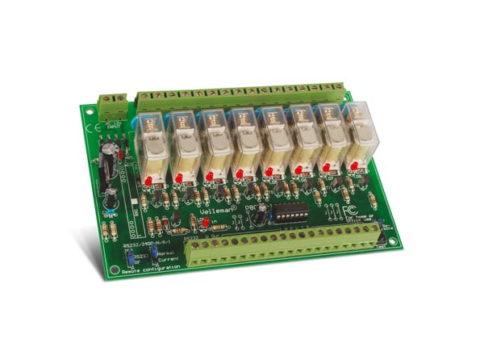

# ProcessingK8056
Drive a Velleman [K8056](https://www.velleman.eu/products/view/?country=fr&lang=fr&id=351282) 
(now called [WSRC8056](https://www.velleman.eu/products/view/?id=461910)) - 8 relays module 
through serial port with Processing

More info on the relay module [here](http://www.velleman.eu/downloads/0/illustrated/illustrated_assembly_manual_k8056.pdf).

## Requirements

### Software
- [Processing 3.x.x](https://processing.org/download)
- [Processing Serial](https://processing.org/reference/libraries/serial/index.html) - should be installed with Processing

### Hardware
- Velleman K8056 or Whadda WSRC8056 8 channels relay module
- RS232 port or USB to Serial adapter

## How to use

### Wiring
Refer to page 9 from the [manual](http://www.velleman.eu/downloads/0/illustrated/illustrated_assembly_manual_k8056.pdf)

### Controlling the relays
- Open and launch ProcessingK8056.pde with Processing  
- Give the focus to the tiny black window
- Press keys to send commands to the relay module
    - **'0'** : Clear all relays
    - **'1'** to **'8'** : Toogle a relay (id 1 to 8)
    - **'9'** : Set all relays
    - **'a'** : Change module address (random value between 1 and 255)
    - **'f'** : Set module address to value 1
    - **'d'** : Display current module address on relays led (MSB)
    - **'v'** : Change all relays state at once
    - **Everything else** : Emergency stop (clear all relays)
